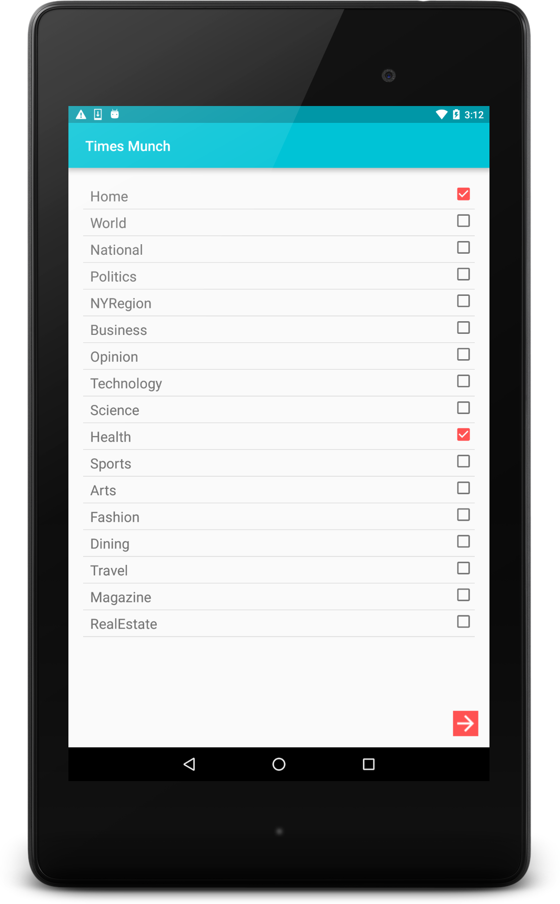
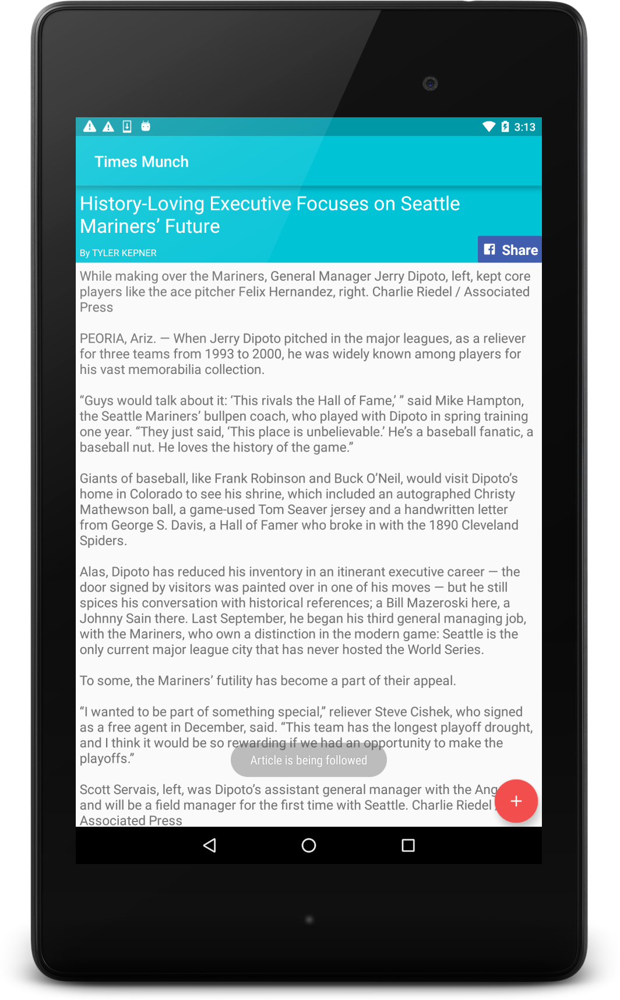
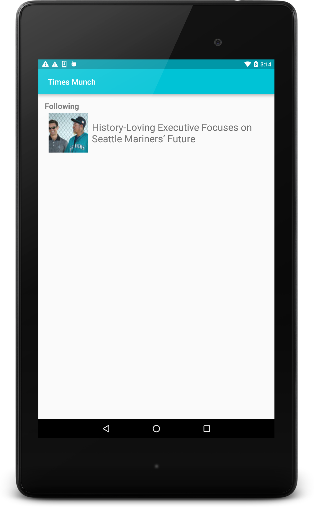
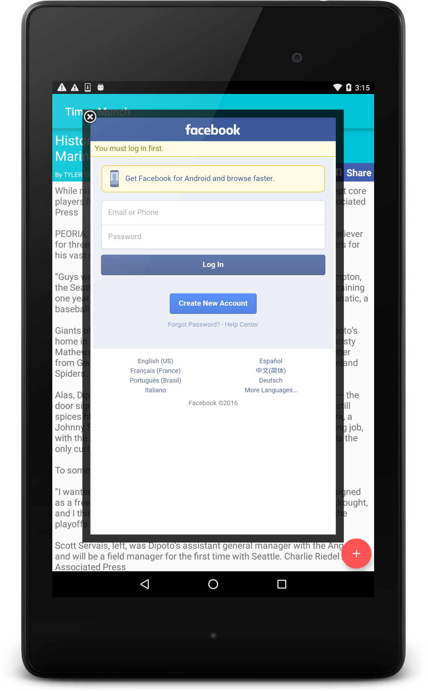

title | project
----- | ---- |
Times Munch App | Project 3
# Times Munch

## Overview
​
Times Munch app allows users to read news based on topics that interest them from the NYTimes. 
​
Users can follow/save articles, share articles via FaceBook and search for articles. 
​
​
## Screenshots
​
A portrait screenshot of how the app looks in the screen to select topics 

---
A portrait screenshot of the list of articles that the user can choose to read 

---

A portrait screenshot of the full article content with the Facebook share button and Follow button 

---
A portrait screenshot of the articles that are being followed/saved 

---
A portrait screenshot of screen when you click the FaceBook share button 

​
# Enjoy :)
